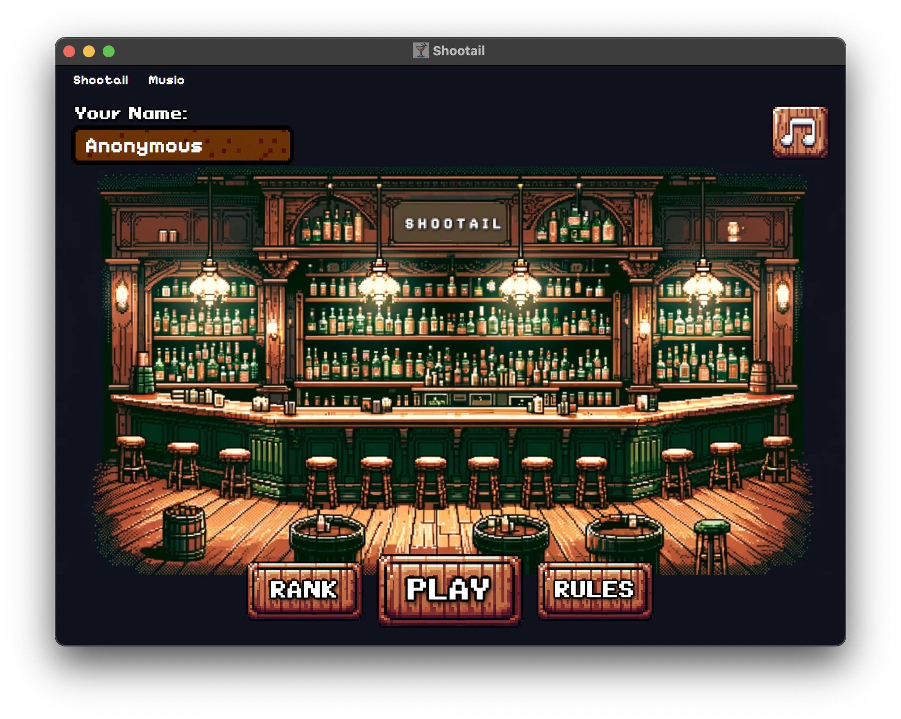
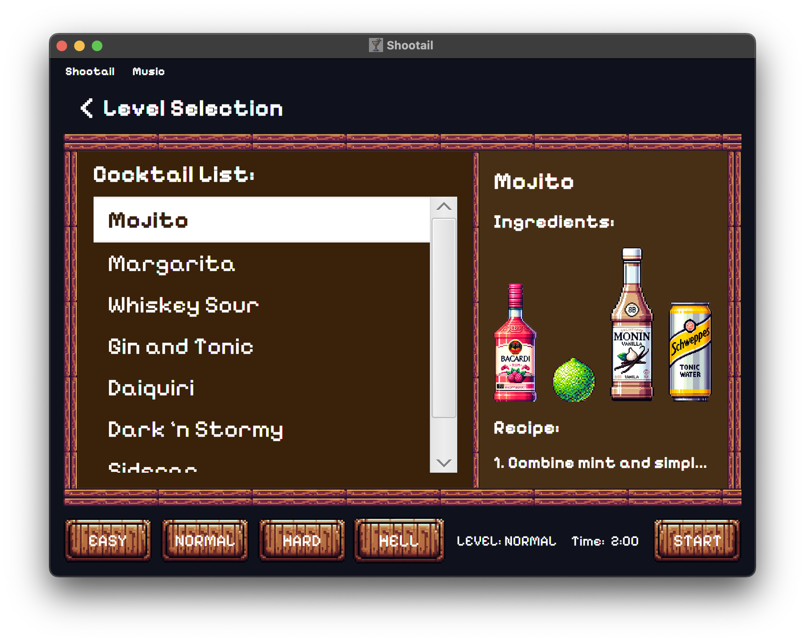
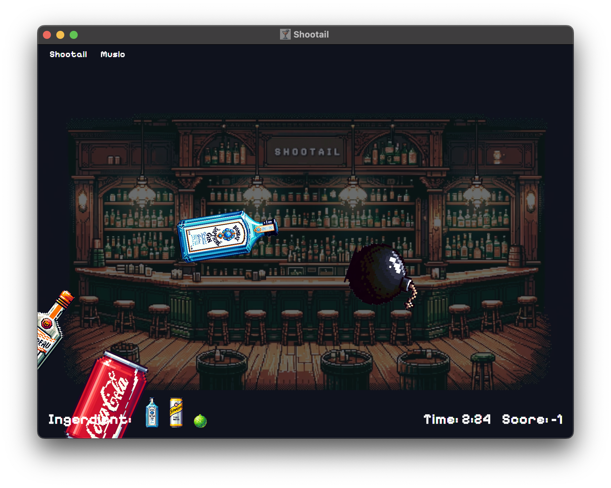

# Shootail

Welcome to Shootail, an engaging cocktail-shooting game built with Scala and ScalaFx. This unique game invites players to mix fun with precision as they aim and shoot at ingredients to create delicious cocktails.

This project is developed as part of a university assignment, showcases the practical application of Scala and ScalaFx in creating engaging software, applying OOP concepts to improve scalability and maintainability

## Game Overview

Shootail turns cocktail mixing into an adventurous game where your aim is to hit the right ingredients. Navigate through various levels, dodge bombs, and shoot accurately to score high!

## Features

- **Dynamic Gameplay**: Powered by ScalaFx for smooth and interactive gameplay.
- **Levels of Fun**: From easy to challenging, each level introduces new twists with bombs in advanced stages.
- **Scalable Design**: Thoughtfully architected for future enhancements, featuring a clean UML class diagram.

## Prerequisites

- **Scala**: Version `2.12.18`
- **ScalaFx**: Version `8.0.192-R14`
- **sbt**: Version `1.9.6`

## Demo

